# Skill graph (generated)

Generated by `npm run gen:skill-doc` from `src/core/skills/catalog.ts`. Do not edit by hand.

**100 skills**, 30 playable in the vertical slice (✅). Band windows (grade position): A = [0, 3), B = [3, 7), C = [7, 10). Unlocking uses *effective* prerequisites: the nearest playable ancestors, so unbuilt nodes never become walls.

## Preschool (age 5)

| | id | English | Македонски | pos | band | prerequisites | tags |
|---|---|---|---|---|---|---|---|
| ✅ | `num.count.10` | Count to 10 | Броење до 10 | 0.0 | A | — |  |
| ✅ | `num.subitize.5` | See amounts to 5 at a glance | Препознај до 5 на прв поглед | 0.0 | A | — | visual |
|  | `geo.shapes.basic` | Name basic shapes | Основни форми | 0.1 | A | — | visual |
|  | `pat.repeat` | Repeating patterns | Правилности што се повторуваат | 0.2 | A | — | visual |
|  | `num.compare.10` | More and less to 10 | Повеќе и помалку до 10 | 0.3 | A | `num.count.10` |  |
| ✅ | `num.line.10` | Number line to 10 | Бројна права до 10 | 0.4 | A | `num.count.10` |  |
| ✅ | `num.subitize.10` | See amounts to 10 at a glance | Препознај до 10 на прв поглед | 0.6 | A | `num.subitize.5` | visual |
|  | `meas.compare` | Longer, heavier, fuller | Подолго, потешко, пополно | 0.8 | A | — | visual |

## Grade 1 / 1 одделение (age 6)

| | id | English | Македонски | pos | band | prerequisites | tags |
|---|---|---|---|---|---|---|---|
| ✅ | `as.bonds.5` | Number bonds to 5 | Разложување на 5 | 1.0 | A | `num.subitize.5`, `num.count.10` | fluency |
| ✅ | `num.count.20` | Count to 20 | Броење до 20 | 1.0 | A | `num.count.10` |  |
| ✅ | `as.add.10` | Add within 10 | Собирање до 10 | 1.1 | A | `as.bonds.5` | fluency |
| ✅ | `as.bonds.10` | Make 10 | Направи 10 | 1.2 | A | `as.bonds.5`, `num.subitize.10` | fluency |
| ✅ | `as.sub.10` | Subtract within 10 | Одземање до 10 | 1.3 | A | `as.add.10` | fluency |
| ✅ | `num.line.20` | Number line to 20 | Бројна права до 20 | 1.3 | A | `num.line.10`, `num.count.20` |  |
|  | `num.compare.20` | Compare numbers to 20 | Споредување броеви до 20 | 1.4 | A | `num.compare.10`, `num.count.20` |  |
|  | `geo.shapes.props` | Sides and corners of shapes | Страни и темиња на форми | 1.5 | A | `geo.shapes.basic` | visual |
| ✅ | `as.add.20` | Add within 20 | Собирање до 20 | 1.6 | A | `as.add.10`, `as.bonds.10`, `num.line.20` | fluency |
|  | `pat.grow` | Growing number patterns | Бројни низи што растат | 1.7 | A | `pat.repeat`, `num.count.20` |  |
| ✅ | `as.sub.20` | Subtract within 20 | Одземање до 20 | 1.8 | A | `as.sub.10`, `as.add.20` | fluency |

## Grade 2 / 2 одделение (age 7)

| | id | English | Македонски | pos | band | prerequisites | tags |
|---|---|---|---|---|---|---|---|
| ✅ | `pv.tens.100` | Tens and ones | Десетки и единици | 2.0 | A | `num.count.20` | visual |
| ✅ | `num.line.100` | Number line to 100 | Бројна права до 100 | 2.1 | A | `num.line.20`, `pv.tens.100` |  |
| ✅ | `as.add.100.noregroup` | Add two-digit numbers | Собирање двоцифрени броеви | 2.2 | A | `as.add.20`, `pv.tens.100` |  |
| ✅ | `as.sub.100.noregroup` | Subtract two-digit numbers | Одземање двоцифрени броеви | 2.3 | A | `as.sub.20`, `pv.tens.100` |  |
|  | `meas.time.hour` | Time to the hour and half hour | Време: цел час и половина | 2.3 | A | `num.count.20` | visual |
|  | `meas.money` | Money in denars | Пари во денари | 2.4 | A | `as.add.100.noregroup` |  |
| ✅ | `as.add.100` | Add within 100 across tens | Собирање до 100 со преминување | 2.5 | A | `as.add.100.noregroup`, `num.line.100` |  |
|  | `meas.length` | Measure in centimetres and metres | Мерење во сантиметри и метри | 2.5 | A | `num.line.20` |  |
| ✅ | `md.groups` | Equal groups | Еднакви групи | 2.6 | A | `as.add.20` | visual |
| ✅ | `as.sub.100` | Subtract within 100 across tens | Одземање до 100 со преминување | 2.7 | A | `as.sub.100.noregroup`, `as.add.100` |  |
| ✅ | `md.mult.2510` | Times 2, 5 and 10 | Множење со 2, 5 и 10 | 2.8 | A | `md.groups` | fluency |

## Grade 3 / 3 одделение (age 8)

| | id | English | Македонски | pos | band | prerequisites | tags |
|---|---|---|---|---|---|---|---|
| ✅ | `pv.1000` | Hundreds, tens and ones | Стотки, десетки и единици | 3.0 | B | `pv.tens.100` | visual |
| ✅ | `num.line.1000` | Estimate on a line to 1000 | Проценка на права до 1000 | 3.1 | B | `num.line.100`, `pv.1000` | estimation |
| ✅ | `as.add.multi` | Column addition with carrying | Писмено собирање со пренесување | 3.2 | B | `as.add.100`, `pv.1000` |  |
|  | `dp.pictograph` | Picture graphs | Сликовити дијаграми | 3.3 | B | `as.add.100.noregroup` | visual, reading |
| ✅ | `md.mult.facts` | Multiplication table | Таблица множење | 3.3 | B | `md.mult.2510` | fluency |
| ✅ | `as.sub.multi` | Column subtraction with borrowing | Писмено одземање со позајмување | 3.4 | B | `as.sub.100`, `as.add.multi` |  |
|  | `meas.time.min` | Time to the minute | Време до минута | 3.4 | B | `meas.time.hour` |  |
| ✅ | `md.div.facts` | Division facts | Таблица делење | 3.5 | B | `md.mult.facts` | fluency |
|  | `f.unit` | Unit fractions | Единечни дропки | 3.6 | B | `md.groups` | visual |
| ✅ | `md.mult.10s` | Multiply by tens and hundreds | Множење со десетки и стотки | 3.6 | B | `md.mult.facts`, `pv.1000` |  |
|  | `geo.perimeter` | Perimeter | Периметар | 3.8 | B | `as.add.multi`, `meas.length` |  |

## Grade 4 / 4 одделение (age 9)

| | id | English | Македонски | pos | band | prerequisites | tags |
|---|---|---|---|---|---|---|---|
|  | `pv.big` | Numbers to a million | Броеви до милион | 4.0 | B | `pv.1000` |  |
|  | `f.of.set` | Fraction of an amount | Дел од количина | 4.2 | B | `f.unit`, `md.div.facts` |  |
| ✅ | `md.mult.multi` | Multi-digit multiplication | Множење повеќецифрени броеви | 4.2 | B | `md.mult.10s`, `as.add.multi` |  |
|  | `dp.bar` | Bar charts and tables | Столбести дијаграми и табели | 4.3 | B | `dp.pictograph` | reading |
|  | `md.div.remainder` | Division with remainders | Делење со остаток | 4.3 | B | `md.div.facts`, `md.mult.10s` |  |
|  | `geo.area.rect` | Area of rectangles | Плоштина на правоаголник | 4.4 | B | `md.mult.facts`, `geo.perimeter` |  |
|  | `f.equiv` | Equivalent fractions | Еднакви дропки | 4.5 | B | `f.unit`, `md.mult.facts` | visual |
|  | `md.factors` | Factors and multiples | Делители и содржатели | 4.5 | B | `md.mult.facts`, `md.div.facts` |  |
|  | `meas.convert` | Converting units | Претворање мерни единици | 4.5 | B | `md.mult.10s` |  |
|  | `f.compare` | Comparing fractions | Споредување дропки | 4.6 | B | `f.equiv` |  |
|  | `geo.angles` | Angles | Агли | 4.6 | B | `geo.shapes.props` | visual |

## Grade 5 / 5 одделение (age 10)

| | id | English | Македонски | pos | band | prerequisites | tags |
|---|---|---|---|---|---|---|---|
|  | `f.add.like` | Adding fractions with like denominators | Собирање дропки со еднакви именители | 5.0 | B | `f.equiv` |  |
|  | `d.tenths` | Tenths and hundredths | Десетти и стотти делови | 5.2 | B | `f.equiv`, `pv.big` |  |
|  | `md.div.long` | Long division | Писмено делење | 5.2 | B | `md.div.remainder`, `md.mult.multi` |  |
|  | `d.compare` | Comparing decimals | Споредување децимални броеви | 5.3 | B | `d.tenths` |  |
|  | `md.primes` | Primes and divisibility | Прости броеви и деливост | 5.3 | B | `md.factors` |  |
|  | `wp.multistep` | Multi-step word problems | Текстуални задачи во повеќе чекори | 5.4 | B | `md.mult.multi`, `as.sub.multi` | reading |
|  | `d.addsub` | Adding and subtracting decimals | Собирање и одземање децимални броеви | 5.5 | B | `d.tenths`, `as.add.multi` |  |
|  | `f.add.unlike` | Adding fractions with unlike denominators | Собирање дропки со различни именители | 5.5 | B | `f.add.like`, `md.factors` |  |
|  | `geo.area.composite` | Area of composite shapes | Плоштина на сложени фигури | 5.6 | B | `geo.area.rect` |  |
|  | `dp.mean` | Average and line graphs | Аритметичка средина и линиски дијаграми | 5.7 | B | `md.div.remainder`, `dp.bar` |  |

## Grade 6 / 6 одделение (age 11)

| | id | English | Македонски | pos | band | prerequisites | tags |
|---|---|---|---|---|---|---|---|
|  | `f.mult` | Multiplying fractions | Множење дропки | 6.0 | B | `f.of.set`, `f.add.like` |  |
|  | `oo.basic` | Order of operations | Редослед на операциите | 6.0 | B | `md.mult.facts`, `md.div.facts`, `as.sub.multi` |  |
|  | `d.multdiv` | Multiplying and dividing decimals | Множење и делење децимални броеви | 6.1 | B | `d.addsub`, `md.mult.multi` |  |
|  | `num.gcd.lcm` | Greatest common divisor and least common multiple | НЗД и НЗС | 6.2 | B | `md.primes` |  |
|  | `f.div` | Dividing fractions | Делење дропки | 6.3 | B | `f.mult` |  |
|  | `meas.convert.decimal` | Unit conversion with decimals | Претворање единици со децимални броеви | 6.3 | B | `meas.convert`, `d.multdiv` |  |
|  | `d.percent` | Percentages | Проценти | 6.4 | B | `d.tenths`, `f.equiv` |  |
|  | `geo.triangles` | Triangles: area and angles | Триаголник: плоштина и агли | 6.4 | B | `geo.angles`, `geo.area.rect` |  |
|  | `geo.volume.cuboid` | Volume of cuboids | Волумен на квадар | 6.5 | B | `geo.area.rect` |  |
|  | `al.expr.intro` | Letters for numbers | Букви наместо броеви | 6.6 | B | `oo.basic` |  |

## Grade 7 / 7 одделение (age 12)

| | id | English | Македонски | pos | band | prerequisites | tags |
|---|---|---|---|---|---|---|---|
| ✅ | `int.intro` | Negative numbers | Негативни броеви | 7.0 | C | `num.line.1000` |  |
| ✅ | `int.addsub` | Adding and subtracting integers | Собирање и одземање цели броеви | 7.1 | C | `int.intro`, `as.sub.multi` | fluency |
|  | `oo.full` | Order of operations with brackets and negatives | Редослед на операциите со загради и негативни броеви | 7.2 | C | `oo.basic`, `int.addsub` |  |
|  | `r.ratio` | Ratios and rates | Размери и стапки | 7.2 | C | `f.equiv`, `md.mult.facts` |  |
|  | `geo.coord` | Coordinate plane | Координатен систем | 7.3 | C | `int.intro` | visual |
|  | `int.multdiv` | Multiplying and dividing integers | Множење и делење цели броеви | 7.3 | C | `int.addsub`, `md.mult.facts` | fluency |
|  | `al.eq.onestep` | One- and two-step equations | Равенки во еден и два чекора | 7.4 | C | `al.expr.intro`, `int.addsub` |  |
|  | `dp.prob.basic` | Basic probability | Основна веројатност | 7.5 | C | `f.equiv`, `f.compare` |  |
|  | `rat.ops` | Operations with rational numbers | Операции со рационални броеви | 7.5 | C | `int.multdiv`, `f.div`, `d.multdiv` |  |
|  | `r.proportion` | Direct and inverse proportion | Права и обратна пропорционалност | 7.6 | C | `r.ratio` |  |
|  | `d.percent.change` | Percentage change | Процентуална промена | 7.7 | C | `d.percent`, `r.ratio` |  |
|  | `geo.circle` | Circles | Круг и кружница | 7.8 | C | `d.multdiv` |  |

## Grade 8 / 8 одделение (age 13)

| | id | English | Македонски | pos | band | prerequisites | tags |
|---|---|---|---|---|---|---|---|
|  | `al.expr.simplify` | Simplifying expressions | Упростување изрази | 8.0 | C | `al.expr.intro`, `int.multdiv` |  |
|  | `pw.powers` | Powers | Степени | 8.0 | C | `int.multdiv`, `oo.full` |  |
|  | `pw.roots` | Square roots | Квадратен корен | 8.1 | C | `pw.powers` |  |
|  | `al.eq.linear` | Linear equations | Линеарни равенки | 8.2 | C | `al.eq.onestep`, `rat.ops` |  |
|  | `dp.stats` | Mean, median and mode | Средина, медијана и мода | 8.3 | C | `dp.mean`, `rat.ops` |  |
|  | `geo.pythag` | Pythagorean theorem | Питагорова теорема | 8.4 | C | `pw.roots`, `geo.triangles` |  |
|  | `al.ineq` | Linear inequalities | Линеарни неравенки | 8.5 | C | `al.eq.linear` |  |
|  | `geo.surface` | Surface area | Плоштина на тела | 8.6 | C | `geo.volume.cuboid`, `geo.circle` |  |
|  | `num.sci` | Scientific notation | Научен запис | 8.7 | C | `pw.powers` |  |

## Grade 9 / 9 одделение (age 14)

| | id | English | Македонски | pos | band | prerequisites | tags |
|---|---|---|---|---|---|---|---|
|  | `al.polynomials` | Polynomials | Полиноми | 9.0 | C | `al.expr.simplify`, `pw.powers` |  |
|  | `fn.intro` | Introduction to functions | Вовед во функции | 9.0 | C | `geo.coord`, `al.eq.linear` |  |
|  | `geo.volume.solids` | Volume of solids | Волумен на тела | 9.2 | C | `geo.surface`, `pw.powers` |  |
|  | `fn.linear` | Linear functions | Линеарна функција | 9.3 | C | `fn.intro` |  |
|  | `geo.similar` | Similar triangles | Слични триаголници | 9.3 | C | `r.proportion`, `geo.triangles` |  |
|  | `al.systems` | Systems of linear equations | Системи линеарни равенки | 9.4 | C | `al.eq.linear`, `fn.intro` |  |
|  | `dp.prob.compound` | Compound probability | Сложена веројатност | 9.5 | C | `dp.prob.basic`, `f.mult` |  |

## DAG

```mermaid
flowchart LR
  subgraph Band_A["Band A"]
    num_subitize_5["See amounts to 5 at a glance"]:::playable
    num_count_10["Count to 10"]:::playable
    geo_shapes_basic["Name basic shapes"]
    pat_repeat["Repeating patterns"]
    num_compare_10["More and less to 10"]
    num_line_10["Number line to 10"]:::playable
    num_subitize_10["See amounts to 10 at a glance"]:::playable
    meas_compare["Longer, heavier, fuller"]
    num_count_20["Count to 20"]:::playable
    as_bonds_5["Number bonds to 5"]:::playable
    as_add_10["Add within 10"]:::playable
    as_bonds_10["Make 10"]:::playable
    as_sub_10["Subtract within 10"]:::playable
    num_line_20["Number line to 20"]:::playable
    num_compare_20["Compare numbers to 20"]
    geo_shapes_props["Sides and corners of shapes"]
    as_add_20["Add within 20"]:::playable
    pat_grow["Growing number patterns"]
    as_sub_20["Subtract within 20"]:::playable
    pv_tens_100["Tens and ones"]:::playable
    num_line_100["Number line to 100"]:::playable
    as_add_100_noregroup["Add two-digit numbers"]:::playable
    as_sub_100_noregroup["Subtract two-digit numbers"]:::playable
    meas_time_hour["Time to the hour and half hour"]
    meas_money["Money in denars"]
    as_add_100["Add within 100 across tens"]:::playable
    meas_length["Measure in centimetres and metres"]
    md_groups["Equal groups"]:::playable
    as_sub_100["Subtract within 100 across tens"]:::playable
    md_mult_2510["Times 2, 5 and 10"]:::playable
  end
  subgraph Band_B["Band B"]
    pv_1000["Hundreds, tens and ones"]:::playable
    num_line_1000["Estimate on a line to 1000"]:::playable
    as_add_multi["Column addition with carrying"]:::playable
    md_mult_facts["Multiplication table"]:::playable
    dp_pictograph["Picture graphs"]
    as_sub_multi["Column subtraction with borrowing"]:::playable
    meas_time_min["Time to the minute"]
    md_div_facts["Division facts"]:::playable
    f_unit["Unit fractions"]
    md_mult_10s["Multiply by tens and hundreds"]:::playable
    geo_perimeter["Perimeter"]
    pv_big["Numbers to a million"]
    md_mult_multi["Multi-digit multiplication"]:::playable
    f_of_set["Fraction of an amount"]
    md_div_remainder["Division with remainders"]
    dp_bar["Bar charts and tables"]
    geo_area_rect["Area of rectangles"]
    md_factors["Factors and multiples"]
    f_equiv["Equivalent fractions"]
    meas_convert["Converting units"]
    f_compare["Comparing fractions"]
    geo_angles["Angles"]
    f_add_like["Adding fractions with like denominators"]
    md_div_long["Long division"]
    d_tenths["Tenths and hundredths"]
    md_primes["Primes and divisibility"]
    d_compare["Comparing decimals"]
    wp_multistep["Multi-step word problems"]
    f_add_unlike["Adding fractions with unlike denominators"]
    d_addsub["Adding and subtracting decimals"]
    geo_area_composite["Area of composite shapes"]
    dp_mean["Average and line graphs"]
    oo_basic["Order of operations"]
    f_mult["Multiplying fractions"]
    d_multdiv["Multiplying and dividing decimals"]
    num_gcd_lcm["Greatest common divisor and least common multiple"]
    f_div["Dividing fractions"]
    meas_convert_decimal["Unit conversion with decimals"]
    d_percent["Percentages"]
    geo_triangles["Triangles: area and angles"]
    geo_volume_cuboid["Volume of cuboids"]
    al_expr_intro["Letters for numbers"]
  end
  subgraph Band_C["Band C"]
    int_intro["Negative numbers"]:::playable
    int_addsub["Adding and subtracting integers"]:::playable
    r_ratio["Ratios and rates"]
    oo_full["Order of operations with brackets and negatives"]
    geo_coord["Coordinate plane"]
    int_multdiv["Multiplying and dividing integers"]
    al_eq_onestep["One- and two-step equations"]
    rat_ops["Operations with rational numbers"]
    dp_prob_basic["Basic probability"]
    r_proportion["Direct and inverse proportion"]
    d_percent_change["Percentage change"]
    geo_circle["Circles"]
    pw_powers["Powers"]
    al_expr_simplify["Simplifying expressions"]
    pw_roots["Square roots"]
    al_eq_linear["Linear equations"]
    dp_stats["Mean, median and mode"]
    geo_pythag["Pythagorean theorem"]
    al_ineq["Linear inequalities"]
    geo_surface["Surface area"]
    num_sci["Scientific notation"]
    fn_intro["Introduction to functions"]
    al_polynomials["Polynomials"]
    geo_volume_solids["Volume of solids"]
    fn_linear["Linear functions"]
    geo_similar["Similar triangles"]
    al_systems["Systems of linear equations"]
    dp_prob_compound["Compound probability"]
  end
  num_count_10 --> num_compare_10
  num_count_10 --> num_line_10
  num_subitize_5 --> num_subitize_10
  num_count_10 --> num_count_20
  num_subitize_5 --> as_bonds_5
  num_count_10 --> as_bonds_5
  as_bonds_5 --> as_add_10
  as_bonds_5 --> as_bonds_10
  num_subitize_10 --> as_bonds_10
  as_add_10 --> as_sub_10
  num_line_10 --> num_line_20
  num_count_20 --> num_line_20
  num_compare_10 --> num_compare_20
  num_count_20 --> num_compare_20
  geo_shapes_basic --> geo_shapes_props
  as_add_10 --> as_add_20
  as_bonds_10 --> as_add_20
  num_line_20 --> as_add_20
  pat_repeat --> pat_grow
  num_count_20 --> pat_grow
  as_sub_10 --> as_sub_20
  as_add_20 --> as_sub_20
  num_count_20 --> pv_tens_100
  num_line_20 --> num_line_100
  pv_tens_100 --> num_line_100
  as_add_20 --> as_add_100_noregroup
  pv_tens_100 --> as_add_100_noregroup
  as_sub_20 --> as_sub_100_noregroup
  pv_tens_100 --> as_sub_100_noregroup
  num_count_20 --> meas_time_hour
  as_add_100_noregroup --> meas_money
  as_add_100_noregroup --> as_add_100
  num_line_100 --> as_add_100
  num_line_20 --> meas_length
  as_add_20 --> md_groups
  as_sub_100_noregroup --> as_sub_100
  as_add_100 --> as_sub_100
  md_groups --> md_mult_2510
  pv_tens_100 --> pv_1000
  num_line_100 --> num_line_1000
  pv_1000 --> num_line_1000
  as_add_100 --> as_add_multi
  pv_1000 --> as_add_multi
  md_mult_2510 --> md_mult_facts
  as_add_100_noregroup --> dp_pictograph
  as_sub_100 --> as_sub_multi
  as_add_multi --> as_sub_multi
  meas_time_hour --> meas_time_min
  md_mult_facts --> md_div_facts
  md_groups --> f_unit
  md_mult_facts --> md_mult_10s
  pv_1000 --> md_mult_10s
  as_add_multi --> geo_perimeter
  meas_length --> geo_perimeter
  pv_1000 --> pv_big
  md_mult_10s --> md_mult_multi
  as_add_multi --> md_mult_multi
  f_unit --> f_of_set
  md_div_facts --> f_of_set
  md_div_facts --> md_div_remainder
  md_mult_10s --> md_div_remainder
  dp_pictograph --> dp_bar
  md_mult_facts --> geo_area_rect
  geo_perimeter --> geo_area_rect
  md_mult_facts --> md_factors
  md_div_facts --> md_factors
  f_unit --> f_equiv
  md_mult_facts --> f_equiv
  md_mult_10s --> meas_convert
  f_equiv --> f_compare
  geo_shapes_props --> geo_angles
  f_equiv --> f_add_like
  md_div_remainder --> md_div_long
  md_mult_multi --> md_div_long
  f_equiv --> d_tenths
  pv_big --> d_tenths
  md_factors --> md_primes
  d_tenths --> d_compare
  md_mult_multi --> wp_multistep
  as_sub_multi --> wp_multistep
  f_add_like --> f_add_unlike
  md_factors --> f_add_unlike
  d_tenths --> d_addsub
  as_add_multi --> d_addsub
  geo_area_rect --> geo_area_composite
  md_div_remainder --> dp_mean
  dp_bar --> dp_mean
  md_mult_facts --> oo_basic
  md_div_facts --> oo_basic
  as_sub_multi --> oo_basic
  f_of_set --> f_mult
  f_add_like --> f_mult
  d_addsub --> d_multdiv
  md_mult_multi --> d_multdiv
  md_primes --> num_gcd_lcm
  f_mult --> f_div
  meas_convert --> meas_convert_decimal
  d_multdiv --> meas_convert_decimal
  d_tenths --> d_percent
  f_equiv --> d_percent
  geo_angles --> geo_triangles
  geo_area_rect --> geo_triangles
  geo_area_rect --> geo_volume_cuboid
  oo_basic --> al_expr_intro
  num_line_1000 --> int_intro
  int_intro --> int_addsub
  as_sub_multi --> int_addsub
  f_equiv --> r_ratio
  md_mult_facts --> r_ratio
  oo_basic --> oo_full
  int_addsub --> oo_full
  int_intro --> geo_coord
  int_addsub --> int_multdiv
  md_mult_facts --> int_multdiv
  al_expr_intro --> al_eq_onestep
  int_addsub --> al_eq_onestep
  int_multdiv --> rat_ops
  f_div --> rat_ops
  d_multdiv --> rat_ops
  f_equiv --> dp_prob_basic
  f_compare --> dp_prob_basic
  r_ratio --> r_proportion
  d_percent --> d_percent_change
  r_ratio --> d_percent_change
  d_multdiv --> geo_circle
  int_multdiv --> pw_powers
  oo_full --> pw_powers
  al_expr_intro --> al_expr_simplify
  int_multdiv --> al_expr_simplify
  pw_powers --> pw_roots
  al_eq_onestep --> al_eq_linear
  rat_ops --> al_eq_linear
  dp_mean --> dp_stats
  rat_ops --> dp_stats
  pw_roots --> geo_pythag
  geo_triangles --> geo_pythag
  al_eq_linear --> al_ineq
  geo_volume_cuboid --> geo_surface
  geo_circle --> geo_surface
  pw_powers --> num_sci
  geo_coord --> fn_intro
  al_eq_linear --> fn_intro
  al_expr_simplify --> al_polynomials
  pw_powers --> al_polynomials
  geo_surface --> geo_volume_solids
  pw_powers --> geo_volume_solids
  fn_intro --> fn_linear
  r_proportion --> geo_similar
  geo_triangles --> geo_similar
  al_eq_linear --> al_systems
  fn_intro --> al_systems
  dp_prob_basic --> dp_prob_compound
  f_mult --> dp_prob_compound
  classDef playable fill:#d8f3e6,stroke:#16804a
```

